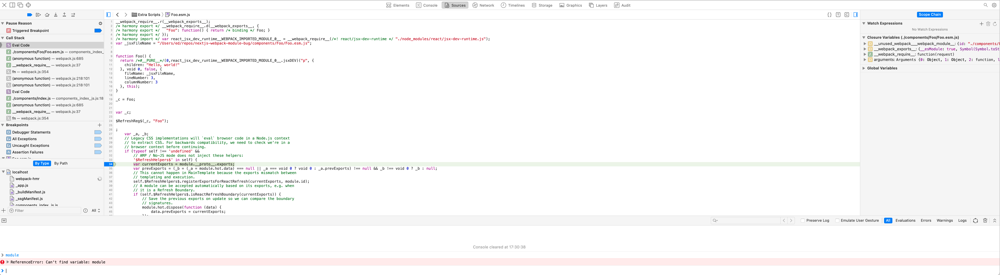
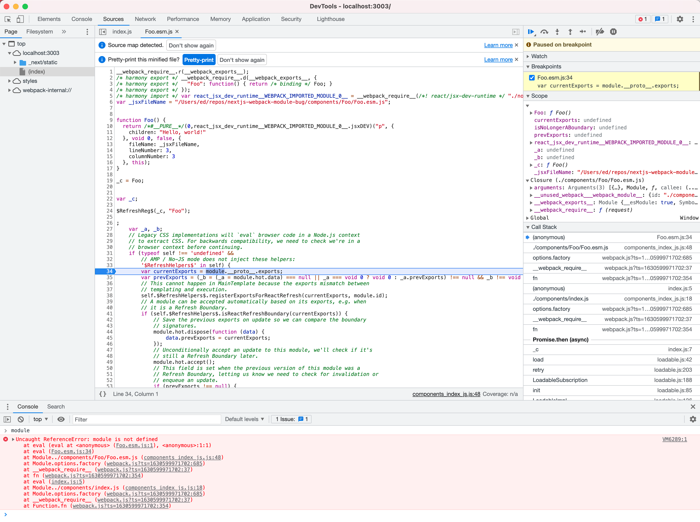

This repository contains a reproduction of a Nextjs error when using Webpack 5 with dynamic module imports.

# The error

When running in development mode with **Webpack 5** enabled the dynamically imported `Foo.esm.js` component fails to load.

If you inspect the file that Webpack generates in your browser's devtools (I recommend that you disable source maps support in the devtools temporarily so you can debug the source-mapped file directly) and place a breakpoint on line 34 you should see that the `module` variable is undefined which causes an error. See the screenshots below for example.

The error only happens when running in development mode with Webpack 5. If you run `npm run build` and `npm run start` , or if you disable Webpack 5 in `next.config.js` and run `npm run dev` then the error does not occur and the dynamic import works.

# How to reprpduce locally

1. Clone this repository
2. Run `npm run dev`
3. Open [http://localhost:3000](http://localhost:3000)

## Screenshots

Safari

Chrome

